## Twitter api monitoring

#### O serviço consome a API de dev do twitter : https://developer.twitter.com/en/docs/twitter-api/v1/rules-and-filtering/build-standard-queries

#### API rest endpoint:

```
/twitter-api/tweets/date : Lista os tweets agrupados pela hora de postagem
```


```
/twitter-api/users-with-most-followers : Lista os 5 usuário com mais seguidores
```


```
/twitter-api/tweets/lang : Lista os tweet agrupados por hashtah e linguagem da publicação
```

### Como executar a aplicação:

```
cd monitoring-api-twitter
```

```
docker-compose up
```
#### Para acessar a api, ir para : http://localhost:9081/twitter-api (ou importe a collection do postman no diretorio postman-collection)

#### Para acessar o Kibana, ir para : http://localhost:5601
* user: elastic
* senha: changeme

#### Ao logar, em create index patter colocar : logstash*
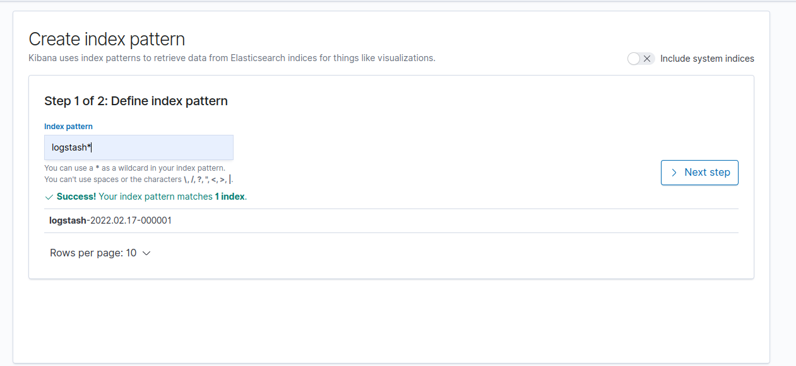

#### Em time field name colocar: @timestamp
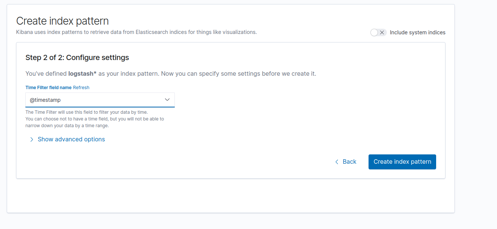

### Em discovery é possivel acompanhar os logs da aplicação
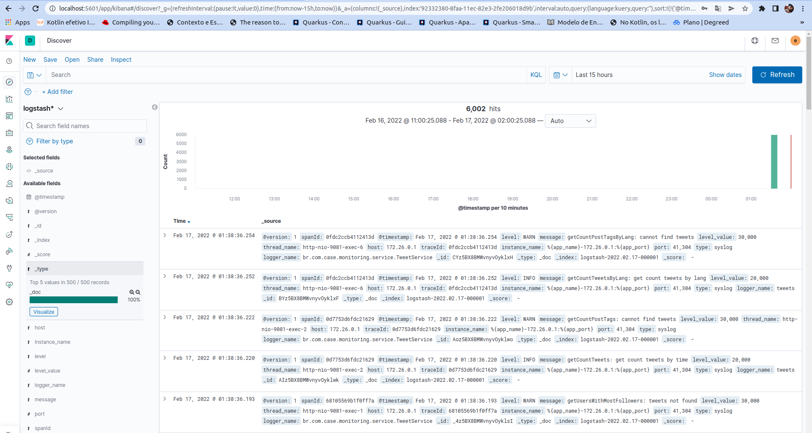
#### Depois ir na opção Saved objects (disponivel em managemente -> kibana -> saved objects) clicar em import
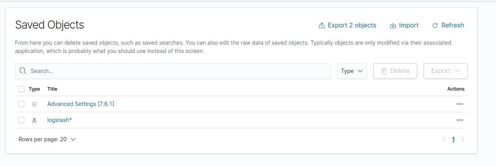
#### selecionar o arquivo "export.ndjson " disponivel na pasta logstash-kibana "
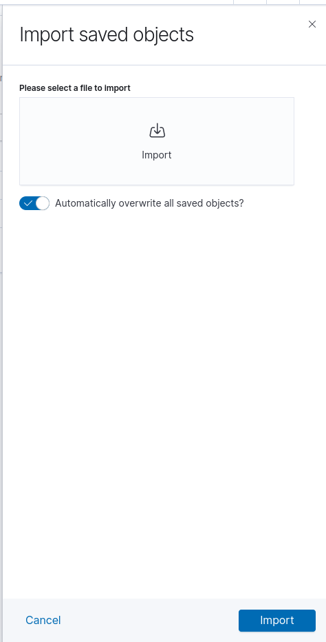
####clique em importar
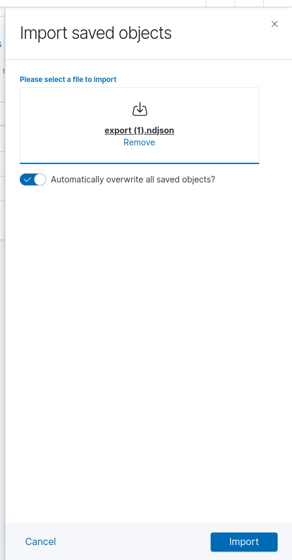
#### em sequida navegue até a aba "Dashboards" e selecione o Dashboard: API-dash e clique em create dashboard
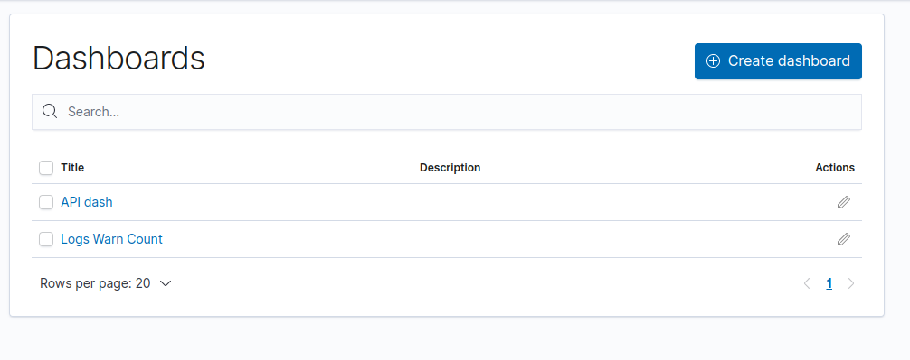

### No painel esta disponivel um dash para monitora o numero de requisções para cada endpoint
### e também o numero de requisções com erro e o uso de cpu da aplicação
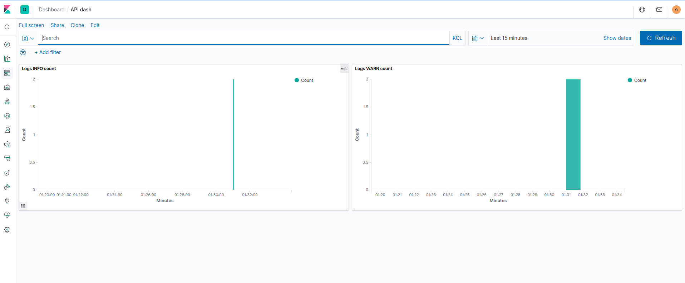

### Prometheus + grafana

* Para acessar o prometheus ir para: http://localhost:9090
* Para acessa o grafana ir para: http://localhost:3000
#### No primeiro acesso ao grafana sera necessario definir um nova senha, ou cliar em skip para manter sem senha
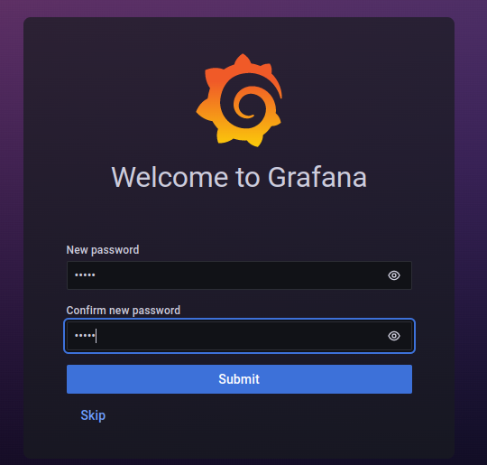
### Para acessar o dash da API selectionar : tweeter-api-dash
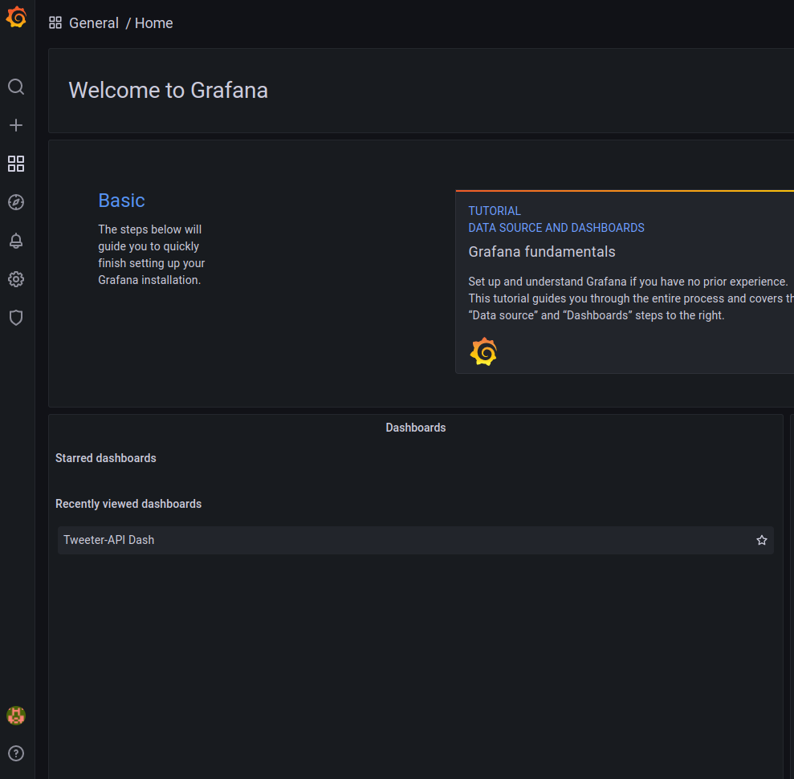
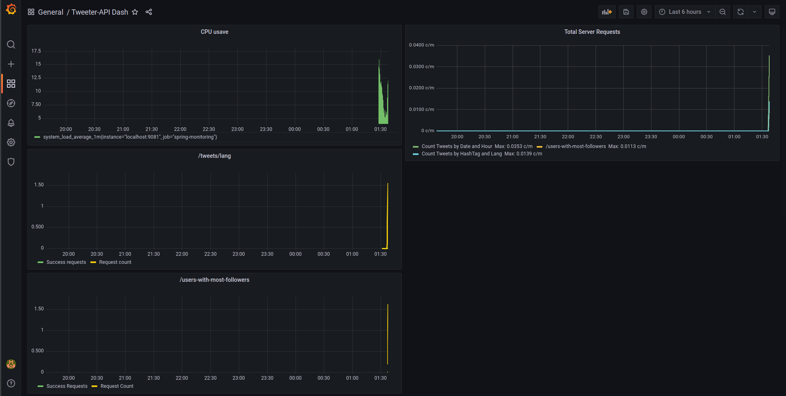

